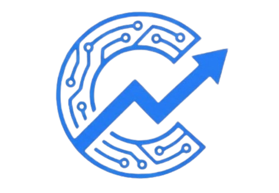
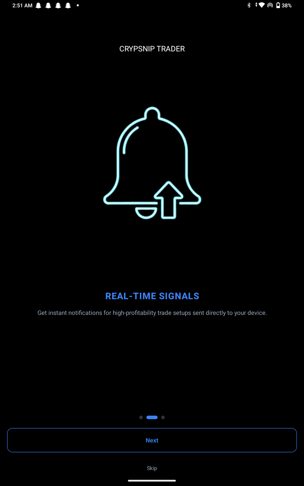
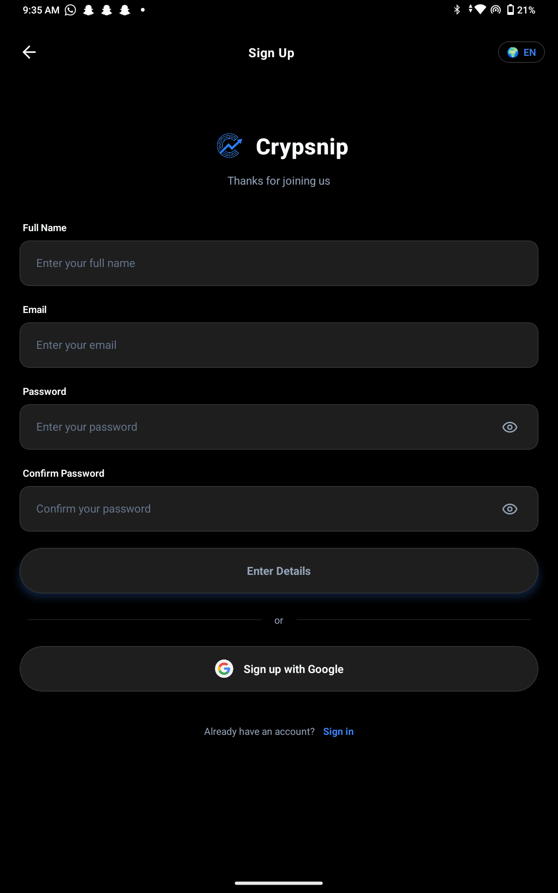
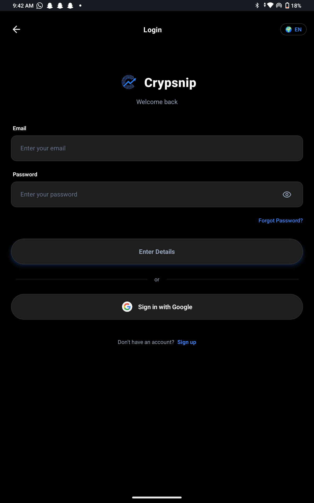
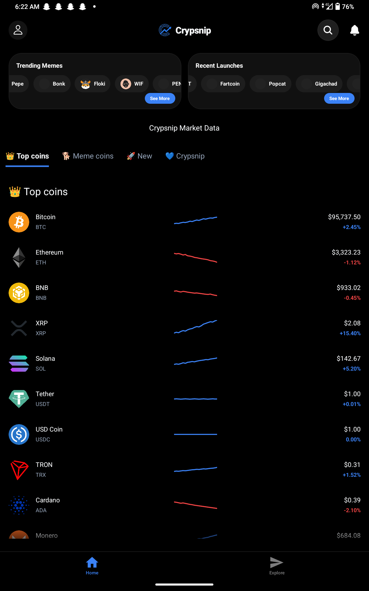
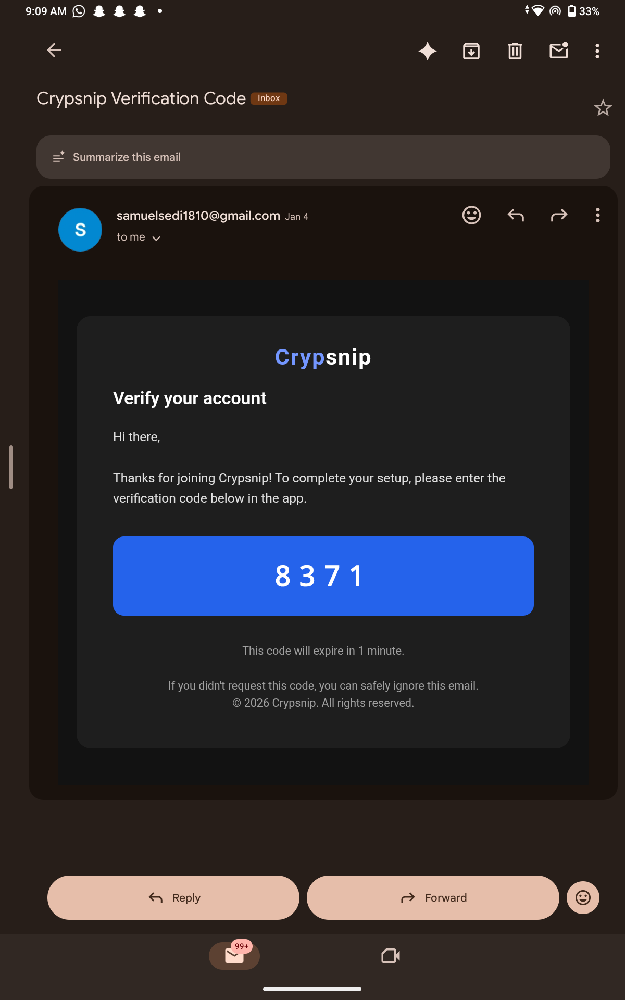
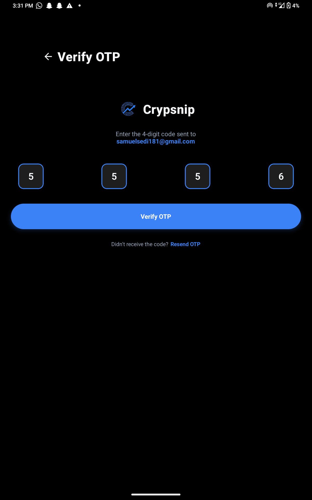

  
  <h1>🚀 Crypsnip</h1>
  
<b>Anti-Rug & Transparency-First Memecoin Launchpad</b>

  
<i>Protecting retail investors from bot-infested launches and rugpull-prone ecosystems.</i>

---

### 📖 Project Drive
Crypsnip was built to solve the "insider" advantage in the memecoin market. While other platforms are plagued by "sniper bots" and "rugpulls," Crypsnip aims to provide a **level playing field** by ensuring transparency through contract verification and real-time liquidity monitoring.

---

### 🛠️ Technical Stack & Performance
* **Mobile Frontend:** High-performance **React Native** UI featuring **Skia-powered** interactive financial charts.
* **Backend Engineering:** Scalable **Spring Boot** microservices utilizing **Rate Limiting (Bucket4j)** and **Asynchronous Workers**.
* **Real-Time Orchestration:** Integrated **Binance WebSockets API** for sub-second price and candle data accuracy.

---

### ✨ Core Features & Visuals

#### 1. Secure Onboarding & Authentication
Multi-layered flow featuring **JWT security** and **4-digit Email OTP** verification.

  
  
  

#### 2. Transparency Dashboard
Real-time market tracking for BTC, ETH, SOL, and emerging memecoins. Includes **Live Trade** feeds and interactive **Skia charts** with multi-timeframe support.

  
  

#### 3. Coin Analytics & Anti-Rug Logic
The security hub for every asset, monitoring developer liquidity locks and contract renouncements.

  
  

---

### 📊 System Architecture

Crypsnip utilizes a decoupled architecture to maintain high availability during peak market volatility. The Spring Boot backend manages heavy lifting like security audits and rate limiting, while the React Native frontend handles smooth data visualization.

---

  
Developed by <b>Sedi Samuel</b>

  
Computer Science Student | Covenant University

